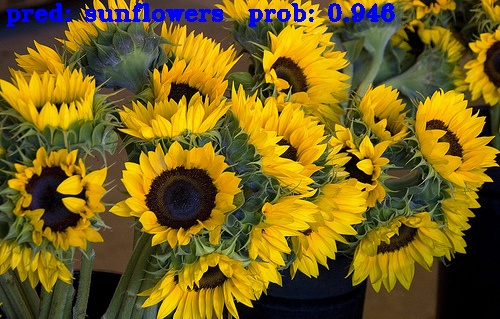

# ViT_Vision_Transformer_torch

Inspired by the success of Transformers in natural language processing, Vision Transformer(ViT) introduces a new way to analyze images by dividing them into smaller patches and leveraging self-attention mechanisms. This allows the model to capture both local and global relationships within images,  leading to impressive performance in various computer vision tasks.

This project develops a object classification model based Vision Transformer from using Pytorch.

 

## Introduction

There are 5 classes in the dataset. Training dataset contains 3000 samples, and validation dataset has 400 samples. During the training, tensorboard is used to monitor process.

## Train the model

Start the model training by running:

```shell
python train.py
```

Open tensorboard to track metrics:

```shell
tensorboard --logdir ./summary/log
```

Get prediction of test samples:

```shell
python predict.py
```

### Training accuracy:


### Training loss:


### Validation accuracy:


### Validation loss:


### Test results

1. Daisy

2. Dandelion

3. Roses

4. Sunflowers

5. Tulips


## Reference

Appreciate the work from the following works:

- [Original paper: An Image is Worth 16x16 Words: Transformers for Image Recognition at Scale](https://arxiv.org/abs/2010.11929)
- [Runist](https://github.com/Runist)/[image-classifier-keras](https://github.com/Runist/image-classifier-keras)/[dataset](https://github.com/Runist/image-classifier-keras/releases/download/v0.2/dataset.zip)
